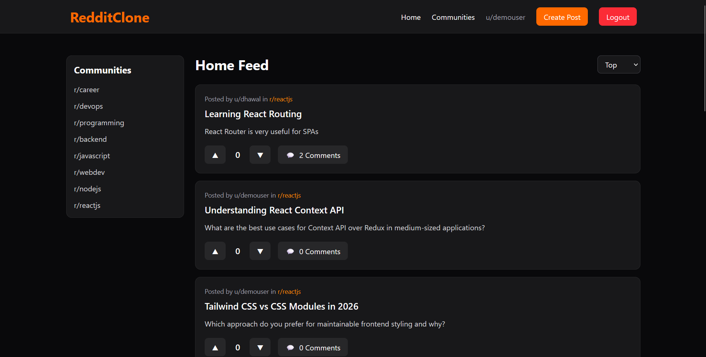
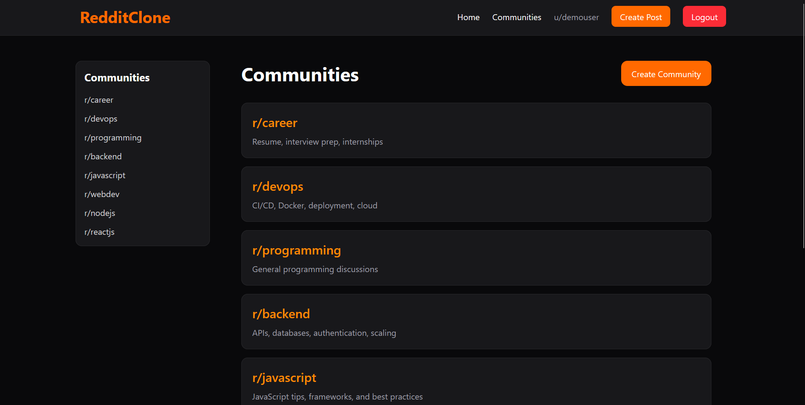
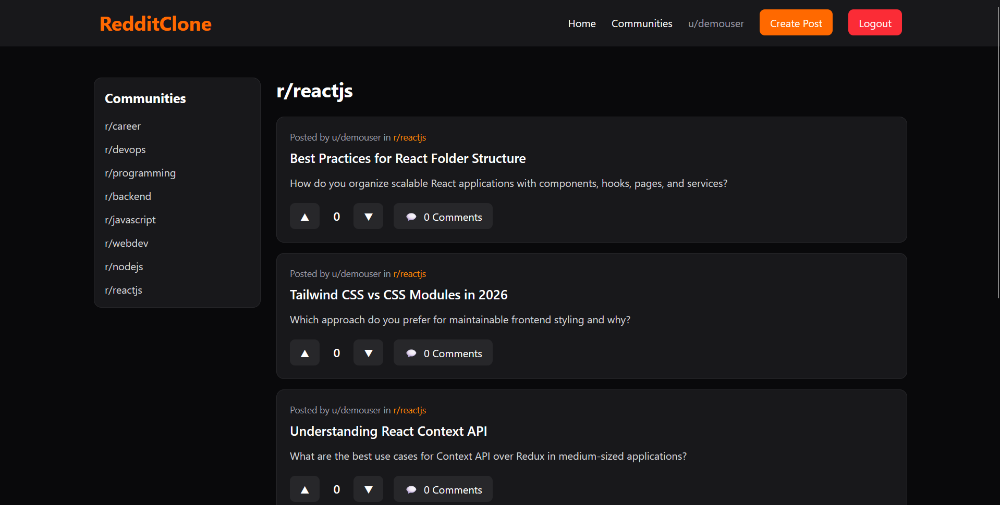
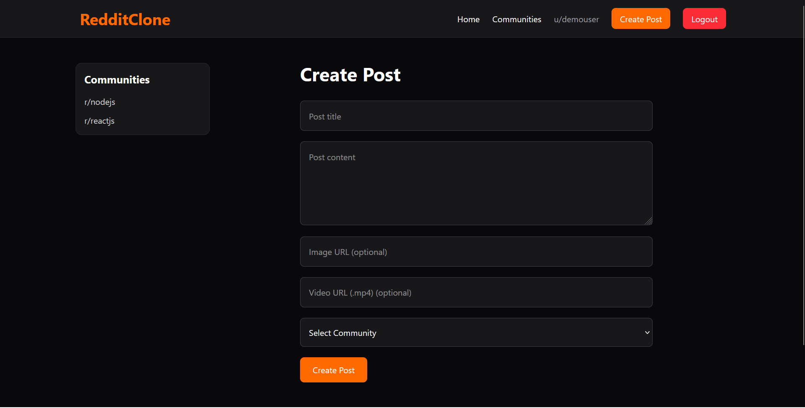
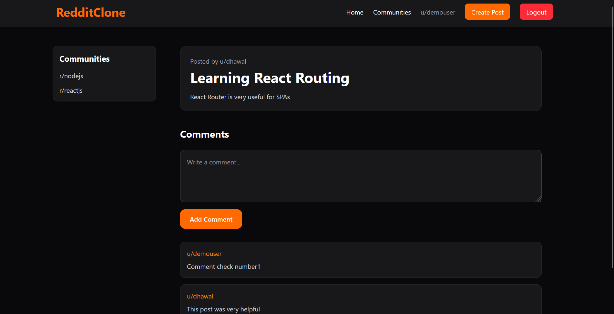
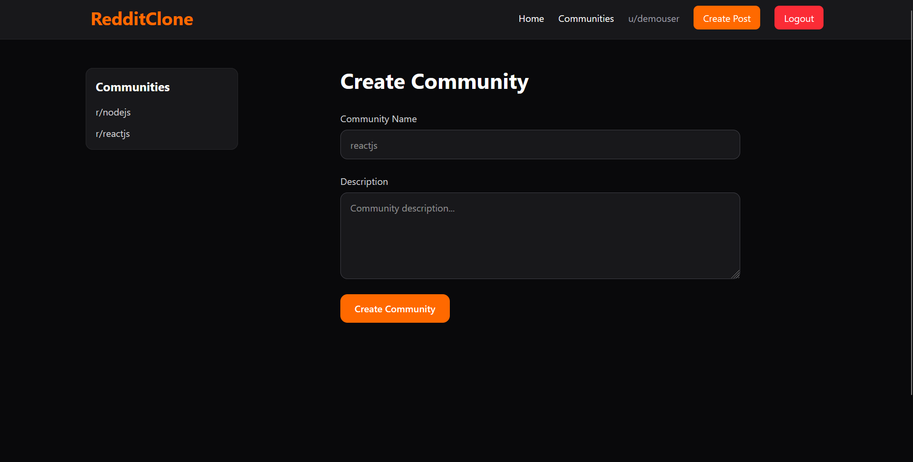
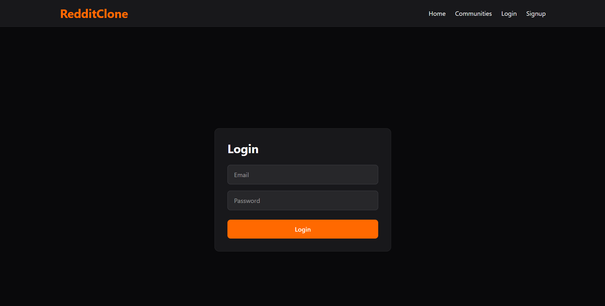

# Reddit Clone

A full-stack Reddit-inspired social discussion platform built using React, Node.js, Express, PostgreSQL, and Prisma ORM.

Users can create communities, publish posts with media support, vote on posts, and participate in threaded discussions through comments.

---

# Features

## Authentication
- User signup and login
- JWT-based authentication
- Protected routes
- Persistent sessions using local storage

---

## Communities
- Create new communities
- Browse all communities
- Dedicated community pages
- Community-specific post feeds

---

## Posts
- Create text posts
- Create image posts
- Create video posts
- Dynamic home feed
- Community-based post filtering
- Individual post detail pages

---

## Voting System
- Upvote posts
- Downvote posts
- Remove votes
- Toggle between vote types
- Real-time vote score updates

---

## Comments
- Add comments to posts
- Display comments under posts
- Dynamic comment counts

---

## Sorting
- Sort posts by:
  - Latest
  - Top voted

---

## UI/UX
- Responsive dark-themed UI
- Sidebar community navigation
- CTA-based interactions
- Dynamic feed updates
- Modern Reddit-inspired layout

---

# Tech Stack

## Frontend
- React
- React Router DOM
- Tailwind CSS
- Axios
- Context API

---

## Backend
- Node.js
- Express.js
- Prisma ORM
- PostgreSQL
- JWT Authentication
- bcrypt

---

# Project Structure

```bash
reddit-clone/
│
├── client/
│   ├── src/
│   ├── public/
│   └── package.json
│
├── server/
│   ├── prisma/
│   ├── src/
│   ├── .env.example
│   └── package.json
│
└── README.md
```

---

# Screenshots

## Home Feed



---

## Communities Page



---

## Community Feed



---

## Create Post



---

## Single Post + Comments



---

## Create Community



---

## Login Page



---

# Installation & Setup

## 1. Clone Repository

```bash
git clone https://github.com/dhawalsarode/reddit-clone.git
cd reddit-clone
```

---

## 2. Setup Backend

```bash
cd server
npm install
```

Create `.env` file inside `server/`

```env
DATABASE_URL=
JWT_SECRET=
PORT=5000
```

Run Prisma migration:

```bash
npx prisma migrate dev
```

Start backend server:

```bash
npm run dev
```

---

## 3. Setup Frontend

```bash
cd client
npm install
npm run dev
```

Frontend runs on:

```bash
http://localhost:5173
```

Backend runs on:

```bash
http://localhost:5000
```

---

# API Endpoints

## Authentication

| Method | Endpoint | Description |
|---|---|---|
| POST | `/api/auth/signup` | Register user |
| POST | `/api/auth/login` | Login user |
| GET | `/api/auth/me` | Get current user |

---

## Communities

| Method | Endpoint | Description |
|---|---|---|
| GET | `/api/communities` | Get all communities |
| POST | `/api/communities` | Create community |

---

## Posts

| Method | Endpoint | Description |
|---|---|---|
| GET | `/api/posts` | Get all posts |
| GET | `/api/posts/:id` | Get single post |
| POST | `/api/posts` | Create post |
| GET | `/api/posts/community/:name` | Get community posts |

---

## Comments

| Method | Endpoint | Description |
|---|---|---|
| POST | `/api/comments` | Add comment |
| GET | `/api/comments/post/:postId` | Get post comments |

---

## Votes

| Method | Endpoint | Description |
|---|---|---|
| POST | `/api/votes` | Vote on post |

---

# Environment Variables

Create:

```bash
server/.env
```

Example:

```env
DATABASE_URL=
JWT_SECRET=
PORT=5000
```

---

# Future Improvements

- Nested comments
- User profiles
- Bookmarking posts
- Notifications
- Infinite scrolling
- Media uploads using cloud storage
- Real-time updates with WebSockets
- Markdown editor
- Search functionality

---

# Author

Dhawal Sarode
GitHub:
https://github.com/dhawalsarode

Project Repository:
https://github.com/dhawalsarode/reddit-clone

